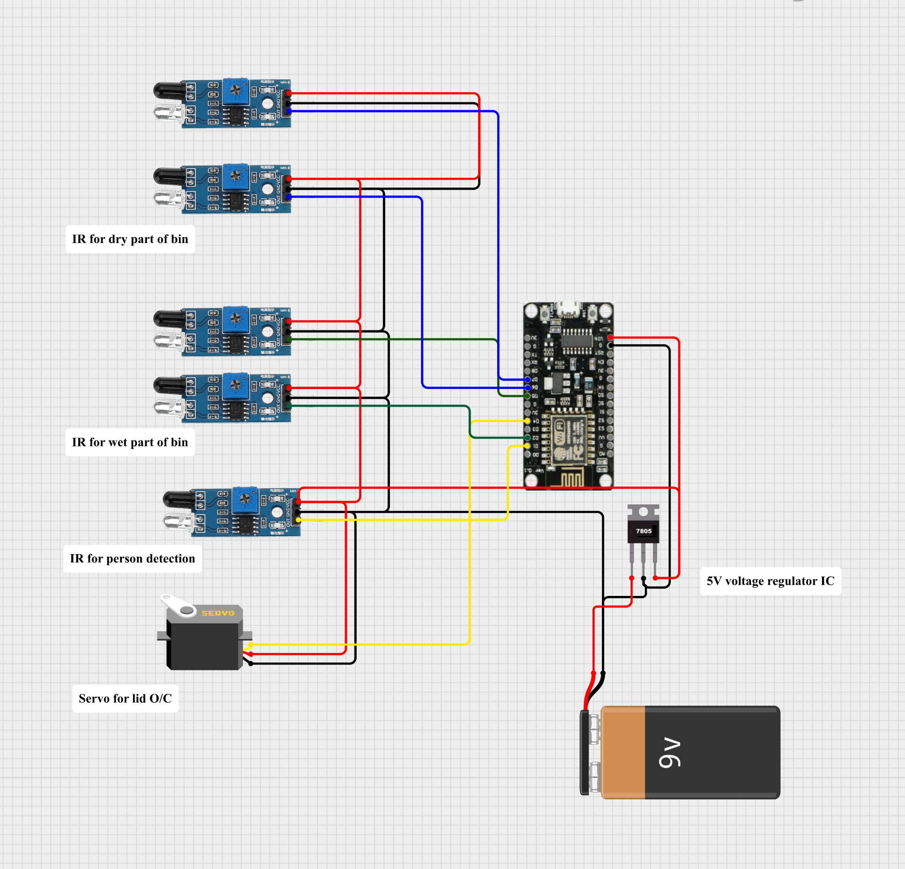

# ♻️ IoT Smart Bin

  <b>Smart waste segregation and monitoring system using ESP8266, IR sensors, servo motor, and ThingSpeak IoT dashboard</b>

---

## 📌 Overview
This project demonstrates an **IoT-based Smart Bin** designed for automated waste monitoring and lid control using an ESP8266 NodeMCU.

The system uses multiple IR sensors for:
- Dry waste detection  
- Wet waste detection  
- Person detection for automatic lid operation  

A servo motor is used for opening and closing the bin lid automatically. The collected sensor data can be monitored through the ThingSpeak IoT dashboard.

---

## ⚙️ Components Used
- ESP8266 NodeMCU  
- IR Sensors  
- Servo Motor  
- 7805 Voltage Regulator IC  
- 9V Battery  
- ThingSpeak IoT Dashboard  

---

## 🧠 Working Principle
- IR sensors detect dry and wet waste levels inside the bin  
- Another IR sensor detects a nearby person  
- When a person is detected, the servo motor opens the lid automatically  
- Sensor data is processed using the ESP8266  
- Data can be monitored remotely using the ThingSpeak dashboard  

---

## 🔌 Circuit Diagram

  

---

## 🎥 Demo Video
[Watch the demo](images/VIDEO.mp4)

---

## 🌐 IoT Dashboard
🔗 ThingSpeak Dashboard:  
https://thingspeak.mathworks.com/channels/3376020

---

## 🛠️ Software & Platform
- Arduino IDE  
- ESP8266 Board Package  
- ThingSpeak  
- Cirkit Designer  

---

## 🔗 Circuit Design Link
https://app.cirkitdesigner.com/project/420129f7-15f3-4a13-bf20-da3a126d7e29

---

## 📂 Project Files
- Arduino source code (.ino)  
- Circuit diagram  
- IoT dashboard link  

---

## 🎯 Applications
- Smart waste management systems  
- Public waste monitoring  
- Automated smart bins  
- IoT-based environmental systems  

---

## 🧑‍💻 Author
**THANGAVIKRAMAN RAMACHANDRAN**  
B.E Electronics and Communication Engineering (Pre-Final Year)

🔗 LinkedIn: https://www.linkedin.com/in/thangavikraman-ramachandran/  
🔗 GitHub: https://github.com/vikram026-cmd
